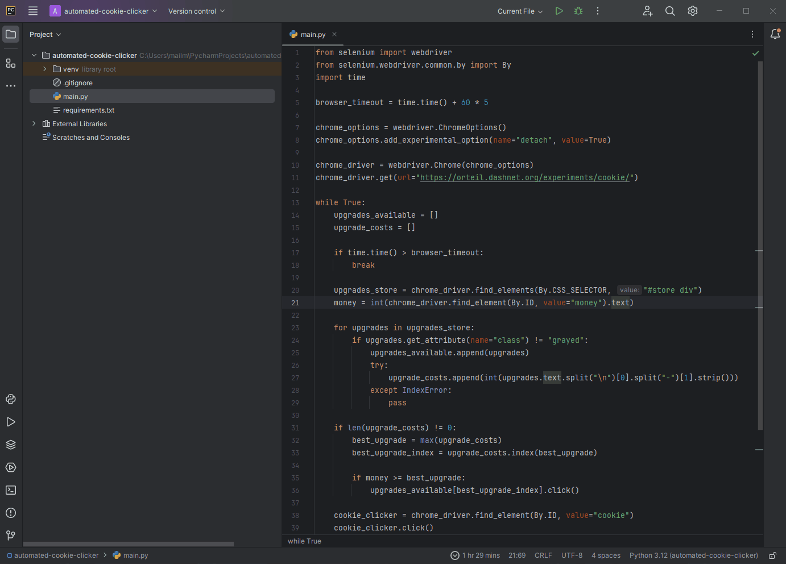
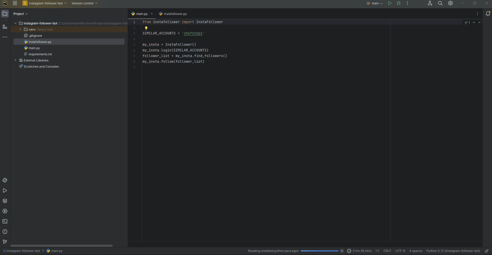

# Python Automation Projects

These python automation projects are built in correspondence with " [100 Days of Code - The Complete Python Pro Bootcamp](https://www.udemy.com/course/100-days-of-code/) " course. This course was taught by London's App Brewery top instructor Angela Yang.<br/>

Each project has been built from scratch with minimal to no assistance.<br/>

### Day 048 - Cookie Clicker

This project automates the Cookie Clicker game using the selenium package.

Steps in the automation process:
1. Navigate to the [Cookie Clicker](https://orteil.dashnet.org/experiments/cookie/) website.
2. Click 🍪 every few seconds (You can set this yourself).
3. Check for any ungrayed upgrades.
4. Click on the cheapest upgrade.
5. Repeat steps (2) to (4) for 5 minutes.



### Day 049 - LinkedIn Job Application

This project automates the job application process on LinkedIn using the selenium package.

Steps in the automation process:
1. Navigate to the [LinkedIn](https://in.linkedin.com/) website.
2. Sign in to LinkedIn.
3. Search for "python developer" job listings.
4. Click "Job" tab.
5. Click "Easy Apply" filter.
6. Click on job.
7. Save job.
8. Follow company.
9. Repeat steps (6) to (8) until there are no more jobs left to click on.


### Day 050 - Tinder Swiping Bot

This project automates the swiping process on Tinder using the selenium package.

Steps in the automation process:
1. Navigate to the [Tinder](https://tinder.com/) website.
2. Click "Log in" button.
3. Click "Log in with Facebook" button.
4. Switch to the Facebook login window.
5. Login to Facebook.
6. Switch back to the Tinder window.
7. Click "Allow" button to give location access to Tinder.
8. Click "Enable" button to enable notifications for your Tinder profile. 
9. Swipe "Nope" a 100 times.


### Day 051 - Internet Speed Twitter Complaint Bot

This project automates the process of fetching UP/DOWN speed from the [Speed Test](https://www.speedtest.net/) website and posting a complaint tweet on [Twitter](https://twitter.com) (If the ISP fails to fulfill it's UP/DOWN speed promise.) using the selenium package.

Steps in the automation process:
1. Navigate to the [Speed Test](https://www.speedtest.net/) website.
2. Click "GO" button.
3. Get and store UP/DOWN speed.
4. Navigate to the [Twitter](https://twitter.com/i/flow/login?lang=en) website.
5. Login to Twitter.
6. If stored UP/DOWN speed from step (3) is less than promised speed, then generate a complaint tweet.
7. Click "Post" button.


### Day 052 - Instagram Follower Bot 	

This project automates the process of following everyone who follows a certain instagram account. This is done using the selenium package.

Steps in the automation process:
1. Navigate to the [Instagram](https://www.instagram.com/) website.
2. Login to Instagram.
3. Click 🔍 button. 
4. Search for "chefsteps".
5. Click on button with "followers" as a partial link text.
6. Navigate to instagram account.
7. Click "Follow" button.
8. Repeat steps (6) and  (7) until there are no more instagram accounts left to follow.



### Day 053 - Data Entry Bot

This project automates the process of scraping real estate listings from the [Zillow](https://www.zillow.com/san-francisco-ca/rentals/?searchQueryState=%7B%22pagination%22%3A%7B%7D%2C%22%20%20%20%20%20%20%20%20%20%20%20%20%20%20%20%20%20%20%20%22%22mapBounds%22%3A%7B%22north%22%3A37.8826759178948%2C%22east%22%3A-122.23248568896484%2C%22south%22%20%20%20%20%20%20%20%20%20%20%20%20%20%20%20%20%20%20%20%22%22%3A37.66775178944106%2C%22west%22%3A-122.63417331103516%7D%2C%22isMapVisible%22%3Atrue%2C%22%20%20%20%20%20%20%20%20%20%20%20%20%20%20%20%20%20%20%20%22%22filterState%22%3A%7B%22price%22%3A%7B%22max%22%3A872627%7D%2C%22beds%22%3A%7B%22min%22%3A1%7D%22%20%20%20%20%20%20%20%20%20%20%20%20%20%20%20%20%20%20%20%22%2C%22fore%22%3A%7B%22value%22%3Afalse%7D%2C%22mp%22%3A%7B%22max%22%3A3000%7D%2C%22auc%22%3A%7B%22%20%20%20%20%20%20%20%20%20%20%20%20%20%20%20%20%20%20%20%22%22value%22%3Afalse%7D%2C%22nc%22%3A%7B%22value%22%3Afalse%7D%2C%22fr%22%3A%7B%22value%22%3Atrue%22%20%20%20%20%20%20%20%20%20%20%20%20%20%20%20%20%20%20%20%22%7D%2C%22fsbo%22%3A%7B%22value%22%3Afalse%7D%2C%22cmsn%22%3A%7B%22value%22%3Afalse%7D%2C%22fsba%22%20%20%20%20%20%20%20%20%20%20%20%20%20%20%20%20%20%20%20%22%22%3A%7B%22value%22%3Afalse%7D%7D%2C%22isListVisible%22%3Atrue%2C%22regionSelection%22%3A%5B%7B%22%20%20%20%20%20%20%20%20%20%20%20%20%20%20%20%20%20%20%20%22%22regionId%22%3A20330%2C%22regionType%22%3A6%7D%5D%2C%22mapZoom%22%3A12%7D) website and filling [SF Renting Research](https://docs.google.com/forms/d/e/1FAIpQLScIi4o8ikHPGDoPwnvwwo9nM-UcYL1rvDlfHUxTh8tsEY83IQ/viewform?usp=sf_link) form using the selenium package.

Steps in the automation process:
1. Use the requests module to get the contents of the [Zillow](https://www.zillow.com/san-francisco-ca/rentals/?searchQueryState=%7B%22pagination%22%3A%7B%7D%2C%22%20%20%20%20%20%20%20%20%20%20%20%20%20%20%20%20%20%20%20%22%22mapBounds%22%3A%7B%22north%22%3A37.8826759178948%2C%22east%22%3A-122.23248568896484%2C%22south%22%20%20%20%20%20%20%20%20%20%20%20%20%20%20%20%20%20%20%20%22%22%3A37.66775178944106%2C%22west%22%3A-122.63417331103516%7D%2C%22isMapVisible%22%3Atrue%2C%22%20%20%20%20%20%20%20%20%20%20%20%20%20%20%20%20%20%20%20%22%22filterState%22%3A%7B%22price%22%3A%7B%22max%22%3A872627%7D%2C%22beds%22%3A%7B%22min%22%3A1%7D%22%20%20%20%20%20%20%20%20%20%20%20%20%20%20%20%20%20%20%20%22%2C%22fore%22%3A%7B%22value%22%3Afalse%7D%2C%22mp%22%3A%7B%22max%22%3A3000%7D%2C%22auc%22%3A%7B%22%20%20%20%20%20%20%20%20%20%20%20%20%20%20%20%20%20%20%20%22%22value%22%3Afalse%7D%2C%22nc%22%3A%7B%22value%22%3Afalse%7D%2C%22fr%22%3A%7B%22value%22%3Atrue%22%20%20%20%20%20%20%20%20%20%20%20%20%20%20%20%20%20%20%20%22%7D%2C%22fsbo%22%3A%7B%22value%22%3Afalse%7D%2C%22cmsn%22%3A%7B%22value%22%3Afalse%7D%2C%22fsba%22%20%20%20%20%20%20%20%20%20%20%20%20%20%20%20%20%20%20%20%22%22%3A%7B%22value%22%3Afalse%7D%7D%2C%22isListVisible%22%3Atrue%2C%22regionSelection%22%3A%5B%7B%22%20%20%20%20%20%20%20%20%20%20%20%20%20%20%20%20%20%20%20%22%22regionId%22%3A20330%2C%22regionType%22%3A6%7D%5D%2C%22mapZoom%22%3A12%7D) website. Store the newly acquired webpage content as text (i.e., string). Use the bs4 (Beautiful Soup 4) library to parse the contents of the webpage and acquire all real estate addresses, links and prices.
2. Navigate to the [SF Renting Research](https://docs.google.com/forms/d/e/1FAIpQLScIi4o8ikHPGDoPwnvwwo9nM-UcYL1rvDlfHUxTh8tsEY83IQ/viewform?usp=sf_link) form.
3. Populate the form with address, link and price details of a property.
4. Click on "Submit" button.
5. Repeat steps (3) and (4) until no more property details are left to fill.
   


## Getting Started

### Prerequisites

<b>For Windows:</b>
<br/> 

Download and Install the latest version of [Python](https://www.python.org/downloads/).<br/><br/>
Download and Install the latest version of [PyCharm Community Edition](https://www.jetbrains.com/pycharm/download/?section=windows).<br/>


<b>For Linux:</b>
<br/> 

<b>Linux</b> comes preinstalled with Python.<br/><br/>
To install the latest version of PyCharm Community Edition, run the following command:
```
sudo snap install pycharm-community --classic
```

### Installing

You can install all the required packages listed in the requirements.txt file for the project at the same time: 


<b>On Windows type:</b>
<br/> 
```
python -m pip install -r requirements.txt
```

<b>On MacOS type:</b>
<br/> 
```
pip3 install -r requirements.txt
```

## Built With
<p>
  
   
   
  
  
  
  
</p>

## Authors

*Initial work* - [grandeurkoe](https://github.com/grandeurkoe)
